# NetPractice: A Comprehensive Guide to Core Networking Concepts

    
    

  

This repository provides a detailed guide to fundamental networking concepts, starting with a high-level visual overview and progressing to in-depth explanations and practical study materials.

---

# Part 1: The Visual Guide

This section provides a high-level, visual introduction to core networking concepts. Each diagram is designed to give you a quick, intuitive understanding of the topic.

## 1.1 Network Segmentation: Flat vs. Secure Architecture

### The Concept

Network design has a critical impact on security. Here we compare two fundamental approaches: a flat network and a segmented network.

-   **Flat Network (Bad Practice):** In this design, all devices (web servers, databases, etc.) are connected to the same network segment. While simple to create, it's highly insecure. If an attacker compromises a single point, like the web server, they have a clear path to move "laterally" to attack other critical systems like the database.

-   **Segmented Network (Good Practice):** This design divides the network into smaller, isolated zones or "subnets" (e.g., a public zone for web servers, a private zone for application logic, and an isolated zone for the database). A firewall or router with strict Access Control Lists (ACLs) sits between these subnets, only allowing authorized traffic to pass. If the web server is compromised, the attacker is contained, as the firewall will block any attempt to directly access the database subnet.

### Visual Comparison

```mermaid
graph TD
    subgraph Data_Center [Data Center / Cloud VPC]

        %% === Part 1: The INSECURE Flat Network (Bad Practice) ===
        subgraph Flat_Network [INSECURE: Flat Network]
            style Flat_Network fill:#ffebeb,stroke:#c00

            Attacker_Flat("Attacker 👿") -- "1. Compromises Web Server" --> Web_Server_Flat("🌐 Web Server")

            Web_Server_Flat --- Switch_Flat{{"Shared Switch"}}
            App_Server_Flat("⚙️ App Server") --- Switch_Flat
            DB_Server_Flat("🗄️ Database") --- Switch_Flat

            Attacker_Flat -- "2. Lateral Movement!<br>Hacker now has direct access to the database.<br><b>CRITICAL FAILURE</b>" --> DB_Server_Flat
        end

        %% === Part 2: The SECURE Segmented Network (Good Practice) ===
        subgraph Segmented_Network [SECURE: Segmented Network]
            style Segmented_Network fill:#e6ffed,stroke:#090

            Attacker_Seg("Attacker 👿") -- "1. Compromises Web Server" --> Web_Server_Seg("🌐 Web Server")

            subgraph Web_Subnet ["Web Subnet (Public)"]
                Web_Server_Seg
            end

            subgraph App_Subnet ["App Subnet (Private)"]
                App_Server_Seg("⚙️ App Server")
            end

            subgraph DB_Subnet ["DB Subnet (Private & Isolated)"]
                DB_Server_Seg("🗄️ Database")
            end

            %% Traffic Flow and Security Control %%
            Web_Server_Seg -- "Allowed API Call" --> Router{{"Router / Firewall<br>with ACLs"}}
            Router -- "Allowed DB Query" --> App_Server_Seg
            App_Server_Seg -- "Allowed DB Connection" --> Router
            Router -- "Allowed DB Access" --> DB_Server_Seg

            Attacker_Seg -.->|"<br>2. Hacker tries to access Database...<br><b>TRAFFIC BLOCKED!</b><br>Security rule DENIES access<br>from Web Subnet to DB Subnet."| Router
        end
    end
```

## 1.2 WAN Technologies: Private Links vs. Public VPN

### The Concept

Connecting geographically separate offices requires a Wide Area Network (WAN). There are two primary strategies for this:

-   **Private WAN (e.g., MPLS):** This involves leasing a dedicated, private line from a telecom provider. It is highly reliable, secure, and offers guaranteed performance, but it comes at a very high cost. It's like having your own private, secure highway between offices.

-   **Public WAN with VPN (e.g., IPsec VPN):** This approach uses the public internet to connect offices. To keep the connection secure, a Virtual Private Network (VPN) is used to create an encrypted "tunnel" for all data that passes between the sites. This is far more cost-effective than a private WAN but its performance depends on the public internet, and it's vulnerable to the same potential latency or outage issues. It's like taking the public highway but inside a secure, armored vehicle.

### Visual Comparison

## 1.3 IP Addresses and Ports: The Network's Address System

### The Concept

For two devices on a network to communicate, they need a clear addressing system. This is accomplished using a combination of IP addresses and port numbers.

-   **IP Address:** This is a unique address assigned to a device on a network, much like a street address for a house. It ensures that data packets are delivered to the correct computer.

-   **Port Number:** If the IP address is the street address of an apartment building, the port number is the apartment number. A single computer can run many different network applications (web server, email server, etc.). Ports allow the computer's operating system to know which specific application should receive the incoming data.
    -   **Well-Known Ports:** Ports 0-1023 are reserved for common services (e.g., HTTP on port 80, HTTPS on 443, SSH on 22).
    -   **Dynamic/Ephemeral Ports:** When your computer connects to a server, it uses a random, high-numbered port (from 49152–65535) for its side of the conversation.

### Visual Example

```mermaid
graph TD
    subgraph Client_Computer ["Your Computer (Client)"]
        style Client_Computer fill:#e6f3ff,stroke:#0069d9

        Client_IP["<b>IP Address:</b> 192.168.1.50"]

        subgraph Applications_Running
            Browser["🌐 Browser"]
            Email["📧 Email Client"]
            Game["🎮 Online Game"]
        end

        Browser -- "Initiates Connection<br>Uses a random high port" --> Request_Packet
    end

    subgraph Server_Computer ["Server"]
        style Server_Computer fill:#e6ffed,stroke:#090

        Server_IP["<b>IP Address:</b> 203.0.113.10"]

        subgraph Services_Listening
            WebService("🌐 Web Service (HTTPS)") <--> Port443("<b>Port 443</b>")
            EmailService("📧 Email Service (SMTP)") <--> Port25("<b>Port 25</b>")
            AdminService("🔒 Admin Service (SSH)") <--> Port22("<b>Port 22</b>")
        end
    end

    Request_Packet -- "<b>Request Packet</b><br>Source: 192.168.1.50 : <b>51234</b> (Dynamic)<br>Destination: 203.0.113.10 : <b>443</b> (Well-Known)" --> WebService

    WebService -- "<b>Response Packet</b><br>Source: 203.0.113.10 : <b>443</b><br>Destination: 192.168.1.50 : <b>51234</b>" --> Browser
```

## 1.4 The OSI and TCP/IP Models: How Data Travels Across a Network

### The Concept

To standardize network communication, conceptual models were developed to describe the different functions involved. The two most famous models are the OSI model and the TCP/IP model. They both describe how data is broken down, packaged, sent, and reassembled.

-   **Encapsulation:** When you send data, it travels down the layers of the model on your computer. At each layer, a header (and sometimes a trailer) is added, containing information relevant to that layer. For example, the Transport layer adds a TCP header with port numbers, and the Network layer adds an IP header with IP addresses. This process of "wrapping" the data in successive layers of control information is called encapsulation.

-   **Decapsulation:** When the data arrives at its destination, it travels up the layers. At each layer, the corresponding header is read, processed, and stripped away, until the original data is delivered to the receiving application.

The diagram below shows the 7 layers of the OSI model and how they map to the more commonly used 4-layer TCP/IP model. It visualizes the journey of data from an application on a sender's PC to an application on a receiver's server.

### Visualizing the Layers

## 1.5 Putting It All Together: End-to-End Communication Flow

### The Concept

This final diagram illustrates a complete communication flow between a client (Samir) and a server (Medhat). It shows how all the previously discussed concepts work together to make a simple network request possible.

The key steps are:
1.  **DNS Lookup:** Before anything can happen, the client's computer needs to translate the human-friendly domain name (`app.com`) into a machine-readable IP address (`203.0.113.10`). It does this by querying a DNS server.
2.  **TCP Handshake:** To establish a reliable connection, the client and server perform a "three-way handshake" (SYN, SYN-ACK, ACK).
3.  **Encapsulation:** The actual data ("Hi") is encapsulated down the OSI/TCP-IP stack, with each layer adding its header.
4.  **Local Network (LAN):** The data frame is sent to the local router. The client's PC uses Address Resolution Protocol (ARP) to find the router's physical MAC address.
5.  **Internet (WAN):** The home router performs Network Address Translation (NAT), swapping the client's private IP for its own public IP. The packet is then routed across the internet to the destination network.
6.  **Decapsulation:** At the server, the process is reversed. The data moves up the stack, with headers being stripped at each layer until the original "Hi" message is delivered to the application.

### Visualizing the Flow

```mermaid
graph TD
    subgraph Samir_Location ["Samir's Location (Client)"]
        Samir_PC["💻 Samir's PC<br>IP: 192.168.1.50"]

        subgraph DNS_Lookup ["Step 0: DNS Lookup"]
            Samir_PC -- "1. Query: 'Where is app.com?'" --> DNS_Server["🌐 DNS Server"]
            DNS_Server -- "2. Reply: 'It's at 203.0.113.10'" --> Samir_PC
        end

        subgraph TCP_Handshake ["Step 1: TCP Handshake"]
            Samir_PC -- "3. SYN (Hello?)" --> App_Server["📱 Medhat's App Server<br>IP: 203.0.113.10"]
            App_Server -- "4. SYN-ACK (Yes, hello!)" --> Samir_PC
            Samir_PC -- "5. ACK (Great!)" --> App_Server
        end

        subgraph Encapsulation ["Step 2: Encapsulation (OSI/TCP-IP Model)"]
            direction TB
            L7["L7 Application: 'Hi' (HTTP POST Data)"] --> L4["L4 Transport: Adds TCP Header with Ports\n= TCP Segment"]
            L4 --> L3["L3 Network: Adds IP Header with IPs\n= IP Packet"]
            L3 --> L2["L2 Data Link: Adds MAC Header with MACs\n= Ethernet Frame"]
            L2 --> L1["L1 Physical: Converted to Electrical Signals\n= Bits"]
        end
    end

    subgraph Local_Network ["Samir's Local Network"]
        Samir_PC ---|"ARP: Finds router's MAC address"| Home_Router["🏠 Home Router"]
        L1 -->|"Frame sent to Router"| Home_Router
    end

    subgraph Internet ["The Internet (WAN)"]
        Home_Router -->|"NAT: Private 192.168.1.50 becomes Public IP\nRouting: Router decapsulates to L3,\nreads destination IP, re-encapsulates,\nand forwards the packet"| Internet_Routers["{...}"]
        Internet_Routers -->|"Packet hops between global routers"| Medhat_Router["🏢 App Server's Router"]
    end

    subgraph Medhat_Location ["Medhat's Location (Server)"]
        Medhat_Router -->|"Frame arrives"| D1["L1 Physical: Receives Bits"]
        subgraph Decapsulation ["Step 3: Decapsulation"]
            direction BT
            D7["L7 Application: 'Hi' is read by the app"] --> D4["L4 Transport: Reads Ports, reassembles Segments"]
            D4 --> D3["L3 Network: Reads IPs"]
            D3 --> D2["L2 Data Link: Reads MACs"]
            D2 --> D1
        end
        D1 -.-> Medhat_App["📱 'Hi' appears for Medhat"]
    end

    style Samir_Location fill:#e6f3ff,stroke:#0069d9
    style Medhat_Location fill:#e6ffed,stroke:#090
```

---

# Part 2: Deep Dive into Core Concepts

This section expands on the foundational topics introduced in the visual guide, providing more detail, context, and "aha moments" to solidify your understanding.

## 2.1 Network Models In-Depth (OSI vs. TCP/IP)

#### The Core Idea: A Common Language for Computers

Network models were developed to solve a fundamental problem: how to make computers from different manufacturers communicate with each other. Without a standard set of rules, the internet would be a chaotic collection of incompatible devices.

> "Once upon a time... if you had a device that was made by two different companies they could not talk." These models "save the day" by defining "how we can connect our stuff so that when IBM makes a computer when Apple makes a computer... we're all putting the same technology inside that computer to make it talk to the other computers."

These models provide a layered framework, breaking down the complex process of network communication into smaller, manageable parts.

#### The OSI Model: The 7-Layer Reference

The Open Systems Interconnection (OSI) model is a 7-layer conceptual framework. While not the model the internet is *built* on, it's the universal reference model used by network engineers for discussion, documentation, and troubleshooting due to its detailed, granular breakdown.

> "The networking world always uses the seven layers, always."
> "Any concept in networking we explain from the perspective of the OSI reference model."

The layers are:
1.  **Physical Layer:** Transmits raw bits (electrical signals, light) over a physical medium (cables, Wi-Fi).
2.  **Data Link Layer:** Manages communication on a local network segment (LAN) using physical **MAC addresses**. Packages data into **Frames**.
3.  **Network Layer:** Handles logical addressing (**IP addresses**) and **routing** data packets across different networks. Packages data into **Packets**.
4.  **Transport Layer:** Ensures end-to-end communication using **port numbers**. It can be reliable (**TCP**) or fast and unreliable (**UDP**). Packages data into **Segments**.
5.  **Session Layer:** Establishes, manages, and terminates communication sessions between applications.
6.  **Presentation Layer:** Handles data formatting, encryption, and compression to ensure it's readable by the receiving application.
7.  **Application Layer:** Provides network services directly to end-user applications (e.g., HTTP for browsers, SMTP for email).

#### The TCP/IP Model: The Practical Standard

The TCP/IP model is the practical, 4-layer architecture that the internet actually uses. It's more streamlined, combining some of the OSI layers.

-   **Link/Network Access Layer:** Combines OSI Layers 1 and 2.
-   **Internet Layer:** Corresponds to OSI Layer 3.
-   **Transport Layer:** Corresponds to OSI Layer 4.
-   **Application Layer:** Combines OSI Layers 5, 6, and 7.

#### Encapsulation & Decapsulation: The Journey of Data

-   **Encapsulation:** As data moves *down* the layers on the sender's device, each layer adds its own header (and sometimes a trailer). This is like putting a letter inside an envelope, then putting that envelope inside a bigger package.
    > "The process of taking our application data and then scooting it on down here and slapping on that layer 4 header, that's called encapsulation."
-   **Decapsulation:** The reverse process occurs on the receiver's side. As data moves *up* the layers, each layer's header is stripped away until the original data is delivered to the application.

## 2.2 IP Addressing and Subnetting

#### The Core Idea: The Internet's Postal Service

An IP address is a unique numerical label assigned to every device on a network. It acts like a postal address, ensuring data packets reach the correct destination.

> "Every device connected to the internet must have a unique IP address to ensure data reaches the correct destination."

**Key Concepts:**
-   **Public vs. Private IP:**
    -   **Public IP:** Assigned by your ISP, globally unique, and visible on the internet.
    -   **Private IP:** Used within a local network (e.g., your home Wi-Fi). These addresses (like `192.168.x.x`, `10.x.x.x`) are not routable on the public internet. Your router uses **NAT (Network Address Translation)** to allow devices with private IPs to share a single public IP.
-   **IPv4 vs. IPv6:**
    -   **IPv4:** 32-bit addresses. The limited supply led to the need for private IPs and NAT.
    -   **IPv6:** 128-bit addresses. Created to solve IPv4 exhaustion, providing a virtually limitless number of addresses.

#### Subnetting: Slicing the Pizza

Subnetting is the process of dividing a large IP network into smaller, more manageable sub-networks. This is crucial for security and performance.

> "You take a big network, like a pizza, and you slice it into smaller pieces called subnets."

-   **Subnet Mask:** A number that defines which part of an IP address is the "network" portion and which is the "host" portion.
-   **CIDR Notation:** A shorthand for the subnet mask (e.g., `/24`). The number indicates how many bits are used for the network address. A higher number means fewer available host IPs.

## 2.3 Transport Protocols: TCP vs. UDP

At the Transport Layer, TCP and UDP offer a fundamental trade-off between reliability and speed.

#### TCP (Transmission Control Protocol): The Reliable Workhorse

TCP prioritizes getting the data right, every time.
-   **Reliable & Ordered:** Guarantees that all packets are delivered in the correct order without errors.
-   **Connection-Oriented:** Establishes a connection using the **Three-Way Handshake** before sending data:
    1.  **SYN:** Client sends a "synchronize" request.
    2.  **SYN-ACK:** Server acknowledges the request and sends its own synchronize packet.
    3.  **ACK:** Client acknowledges the server's packet, and the connection is established.
-   **Use Cases:** Web browsing (HTTP/S), email (SMTP), file transfers (FTP). Anywhere data integrity is non-negotiable.

#### UDP (User Datagram Protocol): The Speedy Sprinter

UDP prioritizes speed, even if it means some data gets lost along the way.
-   **Fast & Lightweight:** Minimal overhead because it doesn't do handshakes, error checking, or retransmissions.
-   **Connectionless:** "Fire and forget." It sends data without establishing a connection first.
-   **Use Cases:** Online gaming, live video/audio streaming (VoIP), DNS. Anywhere a slight glitch is better than a long pause.

#### The Future: HTTP/3 and QUIC

A modern evolution is **HTTP/3**, which is built on a new protocol called **QUIC**. QUIC runs over UDP, giving it the speed of UDP while building in its own reliability and security mechanisms. It eliminates "head-of-line blocking" (where one lost TCP packet stalls all subsequent data) and speeds up connection setup, making it ideal for the modern web.

## 2.4 Essential Application Layer Protocols

These protocols work at the top layer to provide services directly to your applications.
-   **HTTP (Hypertext Transfer Protocol):** The foundation of the web. It uses a request-response model where a client (your browser) requests resources from a server.
-   **HTTPS (HTTP Secure):** The secure version of HTTP. It adds a layer of encryption using **TLS (Transport Layer Security)** to protect your data from eavesdroppers and verify the server's identity.
-   **WebSocket:** Provides a persistent, two-way ("full-duplex") communication channel over a single TCP connection. This is perfect for real-time applications like chat apps, live notifications, and collaborative editing tools, as it avoids the overhead of constantly creating new HTTP requests.
-   **SMTP (Simple Mail Transfer Protocol):** The standard protocol for sending email between mail servers.
-   **FTP (File Transfer Protocol):** Used for transferring files between a client and a server.

---

# Part 3: Network Infrastructure and Design

Understanding the concepts is one thing; knowing how they are implemented with physical and virtual hardware is another. This section covers the devices that build networks and the design principles that make them robust and secure.

## 3.1 Hardware: The Building Blocks of Your Network

Different devices operate at different layers of the OSI model to perform specific functions.

-   **Switches (Layer 2):** The backbone of the Local Area Network (LAN). A switch connects devices within a single network (like in an office or home). It's smarter than a hub because it learns the unique MAC address of each connected device, building a MAC address table. This allows it to forward data frames *only* to the intended recipient, rather than broadcasting them to everyone.
-   **Routers (Layer 3):** The directors of network traffic. A router's primary job is to connect *different* networks together (e.g., your home LAN to the internet WAN). It uses a **routing table** and logical **IP addresses** to determine the best path to forward packets between networks. Routers are essential for segmentation and internet access.
-   **Hubs (Layer 1):** An older, "dumb" device. A hub simply repeats any electrical signal it receives on one port to all other ports. This creates unnecessary traffic ("broadcast storms") and can lead to data collisions, severely degrading performance. Hubs have been almost entirely replaced by switches in modern networking.
-   **Wireless Access Points (WAPs):** These devices allow wireless clients to connect to a wired network. They operate at both Layer 1 (transmitting radio waves) and Layer 2 (handling MAC addresses for wireless devices).

## 3.2 Design Principles Revisited

#### The Critical Importance of Network Segmentation

As shown in the visual guide, a flat network is a security and performance nightmare. Segmentation is the solution.

-   **The Problem with Flat Networks:**
    -   **Security:** A single compromised device (e.g., a public web server) gives an attacker a free pass to move laterally and attack critical internal systems like databases.
    -   **Performance:** Broadcast traffic from all devices is sent to *every other device*, consuming bandwidth and CPU cycles.
-   **The Solution with Segmentation:**
    -   **Isolate and Protect:** Divide the network into smaller, isolated subnets (e.g., a Web Subnet, an App Subnet, a Database Subnet).
    -   **Control the Flow:** Place a router or firewall between these subnets. This device acts as a security guard, using **Access Control Lists (ACLs)** to enforce strict rules about which traffic can pass between segments.
    -   **Real-World Example:** In a hospital, the Guest Wi-Fi network must be segmented from the network containing sensitive medical devices and patient records. This prevents a visitor's potentially malware-infected laptop from accessing or disrupting critical life-support equipment.
-   **Cloud & DevOps Application:** This principle is paramount in the cloud. A **Virtual Private Cloud (VPC)** is built with public and private subnets. **Security Groups** and **Network ACLs** act as powerful, virtual firewalls to enforce segmentation rules, ensuring, for example, that only the application tier can talk to the database tier.

#### Wide Area Networks (WANs)

A WAN connects geographically separate LANs.

-   **Purpose:** To connect an office in London to an office in New York, or to connect an on-premise data center to a cloud provider.
-   **WAN Link Subnets:** The direct connection between two routers on a WAN link is itself a tiny network. A **/30 subnet** is perfect for these point-to-point links because it provides exactly two usable IP addresses—one for each router—with no waste.
-   **Types of Connection:**
    -   **Private WAN (e.g., AWS Direct Connect):** A dedicated, private, and expensive physical connection to a provider. It offers guaranteed performance and high security.
    -   **Public WAN with VPN (e.g., AWS Site-to-Site VPN):** Uses the public internet but creates a secure, encrypted tunnel between sites. It's cost-effective but performance can vary with internet conditions.

---

# Part 4: Practical Networking

This section covers the hands-on tools and fundamental knowledge you need to diagnose issues, test configurations, and work with network data at a low level.

## 4.1 Essential Command-Line Tools

These utilities are indispensable for any developer or network engineer.

-   `nc -vz <host> <port>`: Instantly checks if a specific port is open and listening on a server. Perfect for a quick firewall or service status test.
-   `python3 -m http.server <port>`: Creates a simple, temporary web server in your current directory. An incredibly fast way to share files over a local network.
-   `curl -L -O <URL>`: Downloads a file from a URL directly from your terminal, correctly following any redirects (`-L`).
-   `ping <host>`: The classic tool for testing reachability. It also reveals packet loss (anything >0% is bad) and latency jitter (a high standard deviation in response times indicates an unstable connection).
-   `whois <domain/IP>`: Investigates the ownership and registration details of a domain name or IP address block.
-   `ipcalc <IP/CIDR>`: (Commonly on Linux) A powerful tool for planning and verifying subnets. It calculates network IDs, host ranges, broadcast addresses, and more from a CIDR address.

## 4.2 Browser Developer Tools for Networking

The "Network" tab in your browser's developer tools (F12) is a goldmine for debugging.

-   **Performance Debugging:** The waterfall chart shows how assets load over time. Use the `larger-than:` filter to find oversized images or scripts that are slowing down your site. A high **TTFB (Time to First Byte)** points to a slow backend or database, not a slow network path.
-   **API Testing:** Right-click any API call and "Copy as cURL" to replay and modify it in your terminal. You can also "Copy response" to get the raw JSON data.
-   **Simulate Failures:** Test your site's resilience by simulating a "Slow 3G" connection from the throttling dropdown, or by right-clicking a critical asset (like a CSS file) and selecting "Block request URL" to see how your site behaves when it fails to load.
-   **Infrastructure Verification:** Inspect response headers to check if your CDN or Load Balancer is working correctly (e.g., look for `X-Cache: Hit`).
-   **Find the Cause:** The "Initiator" column tells you exactly which script or line of code triggered a specific network request, making it easy to hunt down bugs.
-   **Export for Help:** If you're stuck, you can "Export HAR..." to save a complete log of all network activity, which you can then share with a colleague for debugging.

## 4.3 Understanding Binary

Computers don't understand letters or decimal numbers. Their native language is binary, a system of 0s and 1s that correspond to electrical states (off or on).

-   **Bit (Binary Digit):** The smallest possible unit of data, either a `0` or a `1`.
-   **Byte:** A group of 8 bits. This is the standard unit for measuring file sizes.
-   **Binary to Decimal Conversion:** To convert a binary number (like `11000001`) to a human-readable decimal number, you sum the "weights" of each position where a '1' appears. The weights for an 8-bit number are: `128`, `64`, `32`, `16`, `8`, `4`, `2`, `1`.
    -   For `11000001`, the '1's are in the 128, 64, and 1 positions.
    -   So, the decimal value is `128 + 64 + 1 = 193`.

---

# Part 5: NetPractice Study Guide

This final section provides resources to test your knowledge and review key terms.

## 5.1 Frequently Asked Questions

<strong>What are network protocols, and why are they essential?</strong>

 
Network protocols are standardized sets of rules that govern how data is exchanged. They are the "hidden engines" of the internet, ensuring that devices from different manufacturers can communicate seamlessly. Without them, the internet would be a chaotic and incompatible mess. Models like TCP/IP and OSI provide the blueprint for these rules.

<strong>What's the difference between a public and a private IP address?</strong>

 
A **public IP** is a globally unique address assigned by your ISP, making your network reachable from the internet. A **private IP** (e.g., `192.168.1.10`) is used only within your local network (LAN) and is not routable on the public internet. Your router uses a process called NAT (Network Address Translation) to let devices with private IPs share a single public IP.

<strong>How do IP addresses and Port numbers work together?</strong>

 
An IP address gets a data packet to the correct *device* (like a street address for a building). A port number tells the device which *application* the packet is for (like an apartment number). Together, an IP and port form a **socket** (e.g., `203.0.113.10:443`), a unique endpoint for a network conversation.

<strong>How do TCP and UDP differ?</strong>

 
- **TCP (Transmission Control Protocol)** is for **reliability**. It establishes a connection with a "three-way handshake" and guarantees that all data arrives in order and without errors. It's used for web pages, email, and file transfers.
- **UDP (User Datagram Protocol)** is for **speed**. It's "fire and forget," sending data without a connection or guarantee of delivery. It's used for live video/audio streaming, online gaming, and DNS lookups, where speed is more important than perfect data integrity.

<strong>What is the Domain Name System (DNS)?</strong>

 
DNS is the "phonebook of the internet." It translates human-friendly domain names (like `www.google.com`) into machine-readable IP addresses (like `142.250.200.78`). Your computer needs the IP address to actually connect to the server; the DNS system just provides the translation.

## 5.2 NetPractice Quiz

Test your knowledge with these short-answer questions. Click to reveal the answer.

<strong>1. What is the primary function of TCP in network communication?</strong>

 
TCP's primary function is to ensure the reliable, ordered, and error-checked delivery of data packets between applications. It establishes a formal connection before transmitting data to guarantee end-to-end delivery without loss.

<strong>2. How does a subnet mask distinguish between the network and host portions of an IP address?</strong>

 
A subnet mask uses a bitwise AND operation. The bits in the mask that are '1' correspond to the network portion of the IP address, while the bits that are '0' correspond to the host portion.

<strong>3. Why are the first and last IP addresses in a subnet reserved?</strong>

 
The first IP address is the "network address," which represents the entire network itself. The last IP address is the "broadcast address," used to send a message to all devices on that specific network. Neither can be assigned to a single host.

<strong>4. What is the "most specific route" rule in routing?</strong>

 
When a router has multiple matching routes for a destination IP, it will always choose the route with the longest subnet mask (e.g., a /26 route is more specific than a /24 route). This allows for more precise traffic direction.

<strong>5. In a routing table, what does the destination `0.0.0.0/0` signify?</strong>

 
This is the "default route," or "gateway of last resort." It's a catch-all route that is used to forward any packet whose destination does not match a more specific route in the table, typically directing it towards the internet.

## 5.3 Glossary of Key Terms

-   **Application Layer:** The top layer of the TCP/IP model where end-user software (e.g., web browsers, email clients) operates.
-   **Broadcast Address:** The last IP address in a subnet range, reserved for sending packets to all hosts within that network.
-   **CIDR Notation:** A method for writing IP addresses and their associated subnet masks (e.g., `192.168.1.0/24`).
-   **Default Gateway:** The IP address of the router on a local network that acts as the "doorway" to other networks.
-   **Default Route (0.0.0.0/0):** A routing table entry that acts as a "gateway of last resort" for unknown destinations.
-   **DHCP (Dynamic Host Configuration Protocol):** A protocol that automatically assigns IP addresses to devices on a network.
-   **DNS (Domain Name System):** The system that translates domain names into IP addresses.
-   **Encapsulation:** The process of adding headers to data as it moves down the network layers on the sender's side.
-   **Gateway:** A network device (usually a router) that acts as an entry and exit point for a network.
-   **Host:** Any device connected to a network, such as a computer, phone, or printer.
-   **Interface:** A physical port or connection point on a network device.
-   **IP Address:** A logical address that uniquely identifies a device on a network.
-   **LAN (Local Area Network):** A network of devices within a limited area, like a home or office.
-   **MAC Address:** A unique physical hardware address assigned to a network interface controller (NIC).
-   **NAT (Network Address Translation):** A method used by routers to translate private IPs to a single public IP.
-   **Network Address:** The first IP address in a subnet, representing the entire network.
-   **Next Hop:** The IP address of the next router a packet should be sent to on its path to the destination.
-   **Packet:** The unit of data at the Network Layer, containing an IP header.
-   **Port Number:** A numerical label that identifies a specific application or service on a device.
-   **Private IP Address:** An IP address used for communication within an internal network, not routable on the internet.
-   **Router:** A Layer 3 device that connects different networks together and forwards packets between them.
-   **Routing Table:** A data table in a router that lists routes to network destinations.
-   **Socket:** The combination of an IP address and a port number (e.g., `192.168.1.50:51234`).
-   **Static Routing:** The manual configuration of routes in a routing table.
-   **Subnet:** A subdivision of a larger IP network.
-   **Subnet Mask:** A number used to distinguish the network and host portions of an IP address.
-   **Switch:** A Layer 2 device that connects devices within a single LAN.
-   **TCP (Transmission Control Protocol):** A reliable, connection-oriented transport protocol.
-   **UDP (User Datagram Protocol):** A fast, connectionless transport protocol.
-   **WAN (Wide Area Network):** A network that connects geographically separate LANs.

---

# Part 6: NetPractice Level Walkthroughs

This section provides a level-by-level guide with hints and explanations to help you solve the NetPractice exercises.

<strong>Level 1: Basic Connectivity</strong>

 

**The Goal:** To understand the most fundamental rule of networking: devices on the same local network must share the same network address.

**The Analogy:** Think of the IP address as a home address. The **network portion** is the "Street Name," and the **host portion** is the "House Number." For two houses to be on the same street, their street name must be identical.

**Key Concepts:**
-   **IP Address:** `Network Part + Host Part`.
-   **Subnet Mask:** This is what defines which part of the IP is the network and which is the host. A mask of `255.255.255.0` (or `/24`) means the first three numbers are the network part. A mask of `255.255.0.0` (or `/16`) means the first two numbers are the network part.

**Hints & Solution:**
-   **Pair A & B (`/24` mask):** Look at Client B's IP address. The first three numbers define the network. Client A must have the same first three numbers. You can choose almost any number from 1-254 for the last part, as long as it's not already taken by Client B.
-   **Pair C & D (`/16` mask):** Look at Client C's IP address. The first two numbers define this network. Client D must have the same first two numbers. You can choose any valid numbers for the last two parts.

**Example Solution:**

<strong>Level 2: Subnet Masks and IP Ranges</strong>

 

**The Goal:** To understand that all devices on the same network segment must use the *exact same subnet mask*, and to work with smaller, non-standard subnet sizes.

**The Analogy:** The subnet mask is like the zoning law for a street. Every house on that street must follow the same law. A `/30` mask is like a very exclusive street with only two houses allowed.

**Key Concepts:**
-   **Identical Masks:** All hosts on the same LAN must have the same subnet mask to understand where the network ends and the hosts begin.
-   **CIDR Notation:** The `/` number (e.g., `/27`, `/30`) is a shorthand for the subnet mask.
-   **Reserved IPs:** The first IP in any subnet (the network address) and the last IP (the broadcast address) cannot be assigned to a device. A `/30` network has 4 total IPs, but only 2 are usable.

**Hints & Solution:**
-   **Pair A & B:** First, make their subnet masks identical (`/27`). A `/27` network contains 32 IP addresses. Use an IP calculator (or binary math) to find which 32-address block Client B's IP belongs to. Then, pick another unused IP from that same block for Client A.
-   **Pair C & D:** They share a `/30` mask, which creates tiny networks of only 4 IPs (2 usable). Choose an IP range that doesn't overlap with anything else (e.g., `192.168.57.252/30`). The two usable IPs in this range would be `192.168.57.253` and `192.168.57.254`. Assign one to each client.

**Example Solution:**

<strong>Level 3: Introduction to Switches</strong>

 

**The Goal:** To understand that a switch connects multiple devices into a single, shared network. All devices connected to the same switch are on the same team.

**The Analogy:** A switch is like a neighborhood community hall. Anyone who plugs into it is part of the same neighborhood and can talk directly to everyone else without needing to go out onto the main road (the router).

**Key Concepts:**
-   **Shared Network:** Everything connected to a switch is on the same broadcast domain and the same subnet.
-   **Same Rules Apply:** All devices must have the same network address and the same subnet mask.

**Hints & Solution:**
-   This is just like Level 1, but with three devices.
-   First, identify the subnet mask that is already defined (`/25`). All three clients **must** use this same mask.
-   Next, look at the fixed IP address of Client A. This IP, combined with the `/25` mask, defines the exact network range for everyone. A `/25` network has 128 addresses.
-   Calculate the valid host IP range for this network (e.g., for the `104.198.73.0/25` network, usable IPs are `.1` to `.126`).
-   Assign any two unused IPs from this valid range to Client B and Client C.

**Example Solution:**

<strong>Level 4: Introduction to Routers</strong>

 

**The Goal:** To understand that a router connects different networks. Each interface on a router acts as a gateway for a separate network and must have an IP address in a unique, non-overlapping subnet.

**The Analogy:** A router is like a major intersection with multiple exits. Each exit leads to a completely different neighborhood (a subnet). The intersection itself can't be part of any single neighborhood; each of its exits has a unique address for the neighborhood it leads to.

**Key Concepts:**
-   **No Overlapping Subnets:** This is the most critical rule for routers. The IP address range of one interface cannot overlap at all with the range of another.
-   **Gateway:** The router's interface IP address is the "default gateway" for all the devices on that specific network.

**Hints & Solution:**
-   First, look at the existing networks on interfaces `R2` and `R3` to see which IP ranges are already taken.
-   Your main task is to define a new network for `R1`, `Client A`, and `Client B`. You need to choose a subnet mask for this network. A `/28` mask (`255.255.255.240`) is a good choice as it provides 14 usable IPs, which is more than enough for the three devices, but is small enough to easily avoid collisions with the other networks.
-   Based on `Client A`'s fixed IP and your chosen mask, determine the network range. For example, if Client A is `67.52.110.132` with a `/28` mask, the network is `67.52.110.128/28`, and the usable IPs are `.129` to `.142`.
-   Assign valid, unused IPs from this calculated range to `Interface R1` and `Client B`.

**Example Solution:**

<strong>Level 5: Routing Tables</strong>

 

**The Goal:** To understand that for a device to send data to another network, it needs a "route." A routing table tells a device where to send packets that are not destined for its own local network.

**The Analogy:** A routing table is like the GPS navigation in your car. To visit a neighbor on your own street, you don't need directions. But to get to a different city, your GPS tells you, "For that destination, your first step is to get on the highway." The router's IP address is the on-ramp to that highway.

**Key Concepts:**
-   **Default Route:** The destination `0.0.0.0/0` is a "catch-all" route. It means "for any destination I don't have a specific rule for, send it here." This is perfect for client machines that only have one way out of their network.
-   **Next Hop:** This is the IP address of the very next router interface in the path. For a client, this is always the IP address of its default gateway (its local router interface).

**Hints & Solution:**
-   First, configure the IP addresses. Ensure `Client A` is on the same network as the router's `Interface R1`. Ensure `Client B` is on the same network as `Interface R2`.
-   **Client A's Routing Table:** The goal is to reach Client B. Since Client A doesn't know where that is, it just needs to send the packet to its gateway.
    -   **Destination:** `0.0.0.0/0` (default)
    -   **Next Hop:** The IP address of `Interface R1`.
-   **Client B's Routing Table:** The same logic applies for the return trip.
    -   **Destination:** `0.0.0.0/0` (default)
    -   **Next Hop:** The IP address of `Interface R2`.

**Example Solution:**

<strong>Level 6: Connecting to the Internet</strong>

 

**The Goal:** To understand that communication is a two-way street. For a client to talk to the internet, there must be a forward path *to* the internet and a return path *from* the internet back to the client.

**The Analogy:** Sending a letter is only half the process. The postal service also needs to know your exact return address to deliver a reply. If you send a letter from "My House" without a street and city, the reply will get lost. The internet router needs a specific network route to send packets back to you.

**Key Concepts:**
-   **Return Route:** The Internet (which acts like a router) needs a specific entry in its routing table to know how to send packets back to your local network.
-   **No Private IPs on the Internet:** The internet does not route traffic to private IP address ranges (like `192.168.x.x` or `10.x.x.x`). Ensure your client IPs are public.

**Hints & Solution:**
1.  **Configure the LAN:** Set up the network between `Client A` and `Router R1` (interface `R11`).
2.  **Configure the WAN:** Set up the network connecting `Router R1` (interface `R12`) and the `Internet`.
3.  **Configure Client A's Route:** The client only knows its local network. To get anywhere else, it needs a default route.
    -   **Destination:** `0.0.0.0/0`
    -   **Next Hop:** The IP of its gateway, `Interface R11`.
4.  **Configure Router R1's Route:** The router knows about its two directly connected networks. To get to the rest of the internet, it also needs a default route.
    -   **Destination:** `0.0.0.0/0`
    -   **Next Hop:** The IP of the Internet's interface it's connected to.
5.  **Configure the Internet's Route (The Key Step):** The internet needs to know how to get back to Client A's network.
    -   **Destination:** The *network address* of the Client A / R11 LAN (e.g., `40.178.145.128/25`).
    -   **Next Hop:** The IP of the router interface it's connected to (`Interface R12`).

**Example Solution:**

<strong>Level 7: Multi-Router Networks & Overlapping</strong>

 

**The Goal:** To master subnetting to prevent IP address range overlaps in a network with multiple routers. Each link (between a client and router, or between two routers) is its own separate network.

**The Analogy:** You are now the city planner for a whole district. You have multiple major intersections (routers) connecting different streets. You must ensure that the house numbers on "Elm Street" are completely different from the house numbers on "Oak Street," otherwise, the mail (data) will get lost.

**Key Concepts:**
-   **Every Link is a Network:** The connection between Router 1 and Router 2 is a network, just like the connection between Client A and Router 1. Each needs its own unique subnet.
-   **Subnet Planning:** Before assigning any IPs, plan your subnets. A `/28` mask is a great choice here because it splits the available address space into 16 small networks of 14 usable IPs each, giving you plenty of unique ranges to assign.

**Hints & Solution:**
1.  **Plan Your Subnets:** Decide on a single mask to use for all three networks to keep it simple (e.g., `/28`).
2.  **Assign Unique Subnets:** Assign a different `/28` block to each of the three network links. For example:
    -   A-to-R1 Link: `119.198.14.0/28` (Usable: `.1` to `.14`)
    -   R1-to-R2 Link: `119.198.14.16/28` (Usable: `.17` to `.30`)
    -   R2-to-C Link: `119.198.14.32/28` (Usable: `.33` to `.46`)
3.  **Configure IPs:** Assign valid IPs from your planned subnets to all the interfaces.
4.  **Configure Routes:**
    -   Client A needs a default route to its gateway (`Interface R11`).
    -   Client C needs a default route to its gateway (`Interface R22`).
    -   Router R1 needs a *specific route* to Client C's network, with the `Next Hop` being `Interface R21`.
    -   Router R2 needs a *specific route* back to Client A's network, with the `Next Hop` being `Interface R12`.

**Example Solution:**

<strong>Level 8: Complex Subnetting & Return Routes</strong>

 

**The Goal:** To correctly subnet a larger, predefined IP block given by an ISP (the Internet router) to serve multiple internal networks.

**The Analogy:** The city has granted you a large block of addresses for a new development (e.g., all addresses from 100 to 199 on Main St.). Your job is to divide that block into smaller, unique streets (subnets) for different purposes—a residential street, a commercial street, and the main road connecting them.

**Key Concepts:**
-   **Working Within a Range:** The Internet's return route (`/26`) defines your total available IP space. All of your subnets must be carved out from within this parent block.
-   **VLSM (Variable-Length Subnet Masking):** While you can use a single mask size (like `/28`), this level demonstrates that you can use masks of different sizes as long as they all fit within the parent `/26` block without overlapping.

**Hints & Solution:**
1.  **Identify Your IP Space:** The Internet's route is to `163.14.136.0/26`. This means your entire available address range is `163.14.136.0` to `163.14.136.63`.
2.  **Plan Your Subnets:** You need three distinct networks. A simple way is to divide the `/26` block into four smaller `/28` blocks:
    -   Network A: `163.14.136.0 - .15`
    -   Network B: `163.14.136.16 - .31`
    -   Network C: `163.14.136.32 - .47`
    -   Network D: `163.14.136.48 - .63`
3.  **Assign Subnets:** Assign one of these blocks to the C-to-R2 link, another to the D-to-R2 link, and a third to the R2-to-R1 link.
4.  **Configure IPs & Routes:** Configure all device IPs based on your plan. Then, set up the routing tables. Clients C and D need default routes to their respective R2 interfaces. Router R2 needs a default route to R1. Router R1 needs a default route to the Internet. The Internet already has its return route configured.

**Example Solution:**

<strong>Level 9: Aggregation & Troubleshooting</strong>

 

**The Goal:** To manage routing for multiple, separate networks connecting to the internet and to troubleshoot common issues like using private IPs.

**The Analogy:** You are now the postmaster for a large region with several different towns. The national postal service (the Internet) doesn't know the layout of your towns; you must provide it with a specific forwarding address (a route) for *each town* it needs to send mail to. Furthermore, you can't use an internal company mail code (a private IP) for a public letter; it will be rejected.

**Key Concepts:**
-   **Specific Return Routes:** When multiple, non-contiguous networks need to be reached, the Internet router needs a separate, specific route for each one. A single default route will not work.
-   **No Private IPs for Public Traffic:** Any device that communicates directly with the internet must have a public IP address. Using a private IP (like `10.0.0.x` or `192.168.x.x`) will cause the connection to fail because the internet's routers are configured to drop traffic to those addresses.

**Hints & Solution:**
-   **Tackle One Goal at a Time:** Focus on getting one client connected to the internet first.
-   **Check for Private IPs:** If you see a `private subnets not routed` error, it's a huge hint that you've used an IP from a reserved range for a device that needs to talk to the internet. Change it to a public address range.
-   **Configure Internet Routes:** For every client network that needs to talk to the internet, you must add a route in the Internet's routing table. The destination must be the specific *network address* for that client's LAN (e.g., `106.198.154.0/25`), and the next hop is the IP of your main router (`R1`).
-   **Internal Routes:** Don't forget the routes between your own routers (`R1` and `R2`) so they know how to reach each other's client networks.

**Example Solution:**

<strong>Level 10: Final Review - Route Summarization</strong>

 

**The Goal:** To subnet a single large address block (`/24`) into multiple smaller networks of various sizes (`/25`, `/26`, `/28`, `/30`) and configure all the necessary routes. This is the final boss.

**The Analogy:** Instead of giving the national postal service a list of every single street in your city, you just give them your city's main zip code (`169.222.32.0/24`). It's the national service's job to get all mail for that zip code to your city's central post office (`Router R1`). From there, it's your job as the local postmaster to use your detailed local maps (your specific routing tables) to figure out which street (subnet) each letter belongs to.

**Key Concepts:**
-   **Route Summarization:** The Internet router has a single, summarized (or "aggregated") route that covers all of your internal networks. This is efficient and scalable.
-   **Meticulous Subnetting:** You must plan your subnets carefully on paper first. All your smaller subnets must fit perfectly inside the larger `/24` block without any overlaps.

**Hints & Solution:**
1.  **Map Your Address Space:** Your entire IP space is `169.222.32.0` to `169.222.32.255`.
2.  **Plan the Subnets:** Carefully assign a unique, non-overlapping block to each of the 4 networks. Start with the biggest masks first or work from the edges of the address space inward. For example:
    -   Network 1 (`/25`): `169.222.32.0` - `169.222.32.127`
    -   Network 2 (`/26`): `169.222.32.128` - `169.222.32.191`
    -   Network 3 (`/28`): `169.222.32.192` - `169.222.32.207`
    -   Network 4 (`/30`): `169.222.32.252` - `169.222.32.255`
3.  **Configure All IPs:** Assign addresses to every interface according to your plan.
4.  **Configure All Routes:** This is the most complex part.
    -   Clients need default routes to their local gateways.
    -   `Router R2` needs routes to reach the networks behind `Router R1`.
    -   `Router R1` needs routes to reach the networks behind `Router R2`, plus a default route pointing to the Internet.
    -   The Internet's route is already set, so you just have to make sure your configuration works with it.

**Example Solution:**

---
## ✍️ Author
- **Youssef Mazini**
  - 🎓 42 Intra: [ymazini](https://profile.intra.42.fr/users/ymazini)
  - 🐙 GitHub: [yomazini](https://github.com/yomazini)
  - 💼 LinkedIn: [Connect with me](https://www.linkedin.com/in/youssef-mazini/)
 
