```mermaid
graph TD
    subgraph Data_Center [Data Center / Cloud VPC]

        %% === Part 1: The INSECURE Flat Network (Bad Practice) ===
        subgraph Flat_Network [INSECURE: Flat Network]
            style Flat_Network fill:#ffebeb,stroke:#c00

            Attacker_Flat("Attacker 👿") -- "1. Compromises Web Server" --> Web_Server_Flat("🌐 Web Server")

            Web_Server_Flat --- Switch_Flat{{"Shared Switch"}}
            App_Server_Flat("⚙️ App Server") --- Switch_Flat
            DB_Server_Flat("🗄️ Database") --- Switch_Flat

            Attacker_Flat -- "2. Lateral Movement!<br>Hacker now has direct access to the database.<br><b>CRITICAL FAILURE</b>" --> DB_Server_Flat
        end

        %% === Part 2: The SECURE Segmented Network (Good Practice) ===
        subgraph Segmented_Network [SECURE: Segmented Network]
            style Segmented_Network fill:#e6ffed,stroke:#090

            Attacker_Seg("Attacker 👿") -- "1. Compromises Web Server" --> Web_Server_Seg("🌐 Web Server")

            subgraph Web_Subnet ["Web Subnet (Public)"]
                Web_Server_Seg
            end

            subgraph App_Subnet ["App Subnet (Private)"]
                App_Server_Seg("⚙️ App Server")
            end

            subgraph DB_Subnet ["DB Subnet (Private & Isolated)"]
                DB_Server_Seg("🗄️ Database")
            end

            %% Traffic Flow and Security Control %%
            Web_Server_Seg -- "Allowed API Call" --> Router{{"Router / Firewall<br>with ACLs"}}
            Router -- "Allowed DB Query" --> App_Server_Seg
            App_Server_Seg -- "Allowed DB Connection" --> Router
            Router -- "Allowed DB Access" --> DB_Server_Seg

            Attacker_Seg -.->|"<br>2. Hacker tries to access Database...<br><b>TRAFFIC BLOCKED!</b><br>Security rule DENIES access<br>from Web Subnet to DB Subnet."| Router
        end
    end
```

# Netpractice: A Visual Guide to Core Networking Concepts

This repository provides a visual explanation of fundamental networking concepts. Each section includes a brief overview of a topic and a Mermaid diagram to illustrate the key ideas.

## 1. Network Segmentation: Flat vs. Secure Architecture

### The Concept

Network design has a critical impact on security. Here we compare two fundamental approaches: a flat network and a segmented network.

-   **Flat Network (Bad Practice):** In this design, all devices (web servers, databases, etc.) are connected to the same network segment. While simple to create, it's highly insecure. If an attacker compromises a single point, like the web server, they have a clear path to move "laterally" to attack other critical systems like the database.

-   **Segmented Network (Good Practice):** This design divides the network into smaller, isolated zones or "subnets" (e.g., a public zone for web servers, a private zone for application logic, and an isolated zone for the database). A firewall or router with strict Access Control Lists (ACLs) sits between these subnets, only allowing authorized traffic to pass. If the web server is compromised, the attacker is contained, as the firewall will block any attempt to directly access the database subnet.

### Visual Comparison

## 2. WAN Technologies: Private Links vs. Public VPN

### The Concept

Connecting geographically separate offices requires a Wide Area Network (WAN). There are two primary strategies for this:

-   **Private WAN (e.g., MPLS):** This involves leasing a dedicated, private line from a telecom provider. It is highly reliable, secure, and offers guaranteed performance, but it comes at a very high cost. It's like having your own private, secure highway between offices.

-   **Public WAN with VPN (e.g., IPsec VPN):** This approach uses the public internet to connect offices. To keep the connection secure, a Virtual Private Network (VPN) is used to create an encrypted "tunnel" for all data that passes between the sites. This is far more cost-effective than a private WAN but its performance depends on the public internet, and it's vulnerable to the same potential latency or outage issues. It's like taking the public highway but inside a secure, armored vehicle.

### Visual Comparison

## 3. IP Addresses and Ports: The Network's Address System

### The Concept

For two devices on a network to communicate, they need a clear addressing system. This is accomplished using a combination of IP addresses and port numbers.

-   **IP Address:** This is a unique address assigned to a device on a network, much like a street address for a house. It ensures that data packets are delivered to the correct computer.

-   **Port Number:** If the IP address is the street address of an apartment building, the port number is the apartment number. A single computer can run many different network applications (web server, email server, etc.). Ports allow the computer's operating system to know which specific application should receive the incoming data.
    -   **Well-Known Ports:** Ports 0-1023 are reserved for common services (e.g., HTTP on port 80, HTTPS on 443, SSH on 22).
    -   **Dynamic/Ephemeral Ports:** When your computer connects to a server, it uses a random, high-numbered port (from 49152–65535) for its side of the conversation.

### Visual Example

```mermaid
graph TD
    subgraph Client_Computer ["Your Computer (Client)"]
        style Client_Computer fill:#e6f3ff,stroke:#0069d9

        Client_IP["<b>IP Address:</b> 192.168.1.50"]

        subgraph Applications_Running
            Browser["🌐 Browser"]
            Email["📧 Email Client"]
            Game["🎮 Online Game"]
        end

        Browser -- "Initiates Connection<br>Uses a random high port" --> Request_Packet
    end

    subgraph Server_Computer ["Server"]
        style Server_Computer fill:#e6ffed,stroke:#090

        Server_IP["<b>IP Address:</b> 203.0.113.10"]

        subgraph Services_Listening
            WebService("🌐 Web Service (HTTPS)") <--> Port443("<b>Port 443</b>")
            EmailService("📧 Email Service (SMTP)") <--> Port25("<b>Port 25</b>")
            AdminService("🔒 Admin Service (SSH)") <--> Port22("<b>Port 22</b>")
        end
    end

    Request_Packet -- "<b>Request Packet</b><br>Source: 192.168.1.50 : <b>51234</b> (Dynamic)<br>Destination: 203.0.113.10 : <b>443</b> (Well-Known)" --> WebService

    WebService -- "<b>Response Packet</b><br>Source: 203.0.113.10 : <b>443</b><br>Destination: 192.168.1.50 : <b>51234</b>" --> Browser
```

## 4. The OSI and TCP/IP Models: How Data Travels Across a Network

### The Concept

To standardize network communication, conceptual models were developed to describe the different functions involved. The two most famous models are the OSI model and the TCP/IP model. They both describe how data is broken down, packaged, sent, and reassembled.

-   **Encapsulation:** When you send data, it travels down the layers of the model on your computer. At each layer, a header (and sometimes a trailer) is added, containing information relevant to that layer. For example, the Transport layer adds a TCP header with port numbers, and the Network layer adds an IP header with IP addresses. This process of "wrapping" the data in successive layers of control information is called encapsulation.

-   **Decapsulation:** When the data arrives at its destination, it travels up the layers. At each layer, the corresponding header is read, processed, and stripped away, until the original data is delivered to the receiving application.

The diagram below shows the 7 layers of the OSI model and how they map to the more commonly used 4-layer TCP/IP model. It visualizes the journey of data from an application on a sender's PC to an application on a receiver's server.

### Visualizing the Layers

## 5. Putting It All Together: End-to-End Communication Flow

### The Concept

This final diagram illustrates a complete communication flow between a client (Samir) and a server (Medhat). It shows how all the previously discussed concepts work together to make a simple network request possible.

The key steps are:
1.  **DNS Lookup:** Before anything can happen, the client's computer needs to translate the human-friendly domain name (`app.com`) into a machine-readable IP address (`203.0.113.10`). It does this by querying a DNS server.
2.  **TCP Handshake:** To establish a reliable connection, the client and server perform a "three-way handshake" (SYN, SYN-ACK, ACK).
3.  **Encapsulation:** The actual data ("Hi") is encapsulated down the OSI/TCP-IP stack, with each layer adding its header.
4.  **Local Network (LAN):** The data frame is sent to the local router. The client's PC uses Address Resolution Protocol (ARP) to find the router's physical MAC address.
5.  **Internet (WAN):** The home router performs Network Address Translation (NAT), swapping the client's private IP for its own public IP. The packet is then routed across the internet to the destination network.
6.  **Decapsulation:** At the server, the process is reversed. The data moves up the stack, with headers being stripped at each layer until the original "Hi" message is delivered to the application.

### Visualizing the Flow

```mermaid
graph TD
    subgraph Samir_Location ["Samir's Location (Client)"]
        Samir_PC["💻 Samir's PC<br>IP: 192.168.1.50"]

        subgraph DNS_Lookup ["Step 0: DNS Lookup"]
            Samir_PC -- "1. Query: 'Where is app.com?'" --> DNS_Server["🌐 DNS Server"]
            DNS_Server -- "2. Reply: 'It's at 203.0.113.10'" --> Samir_PC
        end

        subgraph TCP_Handshake ["Step 1: TCP Handshake"]
            Samir_PC -- "3. SYN (Hello?)" --> App_Server["📱 Medhat's App Server<br>IP: 203.0.113.10"]
            App_Server -- "4. SYN-ACK (Yes, hello!)" --> Samir_PC
            Samir_PC -- "5. ACK (Great!)" --> App_Server
        end

        subgraph Encapsulation ["Step 2: Encapsulation (OSI/TCP-IP Model)"]
            direction TB
            L7["L7 Application: 'Hi' (HTTP POST Data)"] --> L4["L4 Transport: Adds TCP Header with Ports\n= TCP Segment"]
            L4 --> L3["L3 Network: Adds IP Header with IPs\n= IP Packet"]
            L3 --> L2["L2 Data Link: Adds MAC Header with MACs\n= Ethernet Frame"]
            L2 --> L1["L1 Physical: Converted to Electrical Signals\n= Bits"]
        end
    end

    subgraph Local_Network ["Samir's Local Network"]
        Samir_PC ---|"ARP: Finds router's MAC address"| Home_Router["🏠 Home Router"]
        L1 -->|"Frame sent to Router"| Home_Router
    end

    subgraph Internet ["The Internet (WAN)"]
        Home_Router -->|"NAT: Private 192.168.1.50 becomes Public IP\nRouting: Router decapsulates to L3,\nreads destination IP, re-encapsulates,\nand forwards the packet"| Internet_Routers["{...}"]
        Internet_Routers -->|"Packet hops between global routers"| Medhat_Router["🏢 App Server's Router"]
    end

    subgraph Medhat_Location ["Medhat's Location (Server)"]
        Medhat_Router -->|"Frame arrives"| D1["L1 Physical: Receives Bits"]
        subgraph Decapsulation ["Step 3: Decapsulation"]
            direction BT
            D7["L7 Application: 'Hi' is read by the app"] --> D4["L4 Transport: Reads Ports, reassembles Segments"]
            D4 --> D3["L3 Network: Reads IPs"]
            D3 --> D2["L2 Data Link: Reads MACs"]
            D2 --> D1
        end
        D1 -.-> Medhat_App["📱 'Hi' appears for Medhat"]
    end

    style Samir_Location fill:#e6f3ff,stroke:#0069d9
    style Medhat_Location fill:#e6ffed,stroke:#090
```

